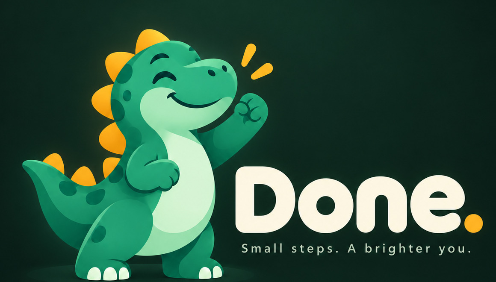
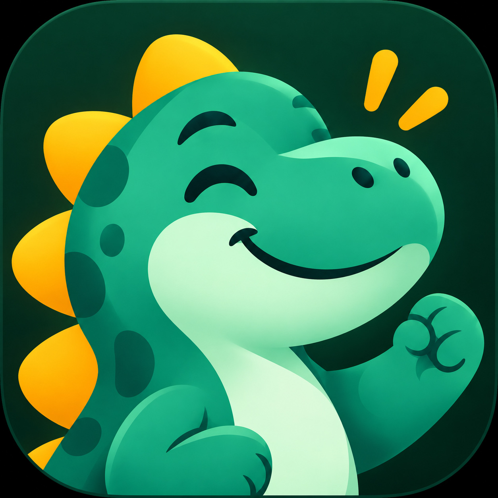
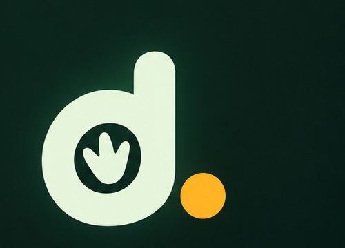

# Done.

  

<em>Small steps. A brighter you.</em>

  

Done. is a modular, all-in-one app for managing personal life — calendar, tasks and routines, gym tracking, study planning, notes, weekly reviews, and optional AI assistance, brought into one consistent workspace. Enable only the modules you need; disabled modules disappear from navigation and dashboards but keep their data until you choose to delete it.

Built primarily for daily personal use, and as a deliberate learning project for frontend and backend engineering.

## Platforms

- macOS desktop — menu bar access, quick capture, notifications
- Android phones and tablets — home-screen widgets, notifications, quick capture

## Status

**Phase 0 — Definition.** Product scope and architecture are being settled before application scaffolding begins.

## Stack

Confirmed:

| Layer | Choice |
| --- | --- |
| macOS app shell | Electron |
| Backend framework | Elysia (Bun) |
| ORM | Prisma |
| Database | PostgreSQL |
| AI | Codex CLI (`codex exec`) via existing ChatGPT/Codex subscription — no pay-per-token API billing |

Proposed, not yet confirmed:

| Layer | Candidate |
| --- | --- |
| Android app | Expo (React Native) with a custom dev client |
| Shared design system | Tamagui |
| AI fallback provider | Pay-per-token API (Anthropic/OpenAI), kept swappable in case subscription-based access is restricted later |

## Architecture

Done separates a small **core** — app shell, navigation, settings, module registry, shared design system, notification infrastructure, quick capture, and the AI gateway — from independent **modules** that register with it. Candidate modules: calendar, tasks/routines, gym, study, notes, weekly review, AI assistance. These are candidates, not a commitment to build everything in an initial release.

## Brand

- Name: **Done.** — including the period.
- Mascot: a friendly green dinosaur with mint highlights and gold/yellow accents (no checkmark-shaped mouth).
- Planned: users will be able to design their own pet and have it replace the dinosaur everywhere, including the app icon.
- Dark, premium background direction; calm, mature interfaces with playful mascot moments, including a possible "DOOOONE!" celebration for meaningful achievements — with optional sound and reduced-motion support.

  
  &nbsp;&nbsp;
  

## License

[MIT](LICENSE)
